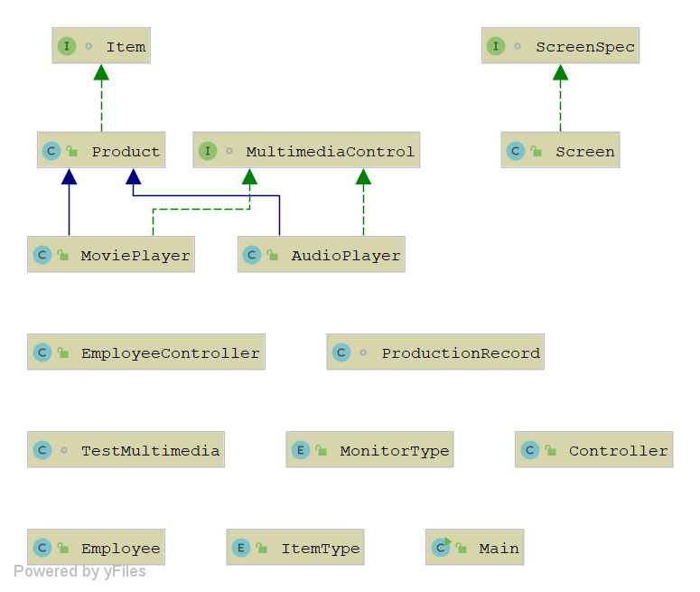

# Project Title
This project is a production line tracker for a metaphorical production company. I made this independently over the course of three months. This project was developed for my object-oriented programming class at Florida Gulf Coast University. This was my first project with a fully integrated UI and database integration. Although this was a class assignment I did enjoy the challenges that came with molding UI and database all into one program. Forgive the visuals, I am not the greatest designer, but am proud of this program's functionality.

## Demonstration

## Documentation

## Diagrams

## Getting Started

## Built With

## Contributing

## Author
Adam Dressel

## License

## Acknowledgments
geeksforgeeks.com
docs.oracle.com
https://www.tutorialspoint.com/javafx/
https://www.tutorialspoint.com/jdbc 
http://tutorials.jenkov.com/javafx/
https://www.baeldung.com/java-pad-string
and...
Thank you to Professor Vanselow
## History

## Key Programming Concepts Utilized

