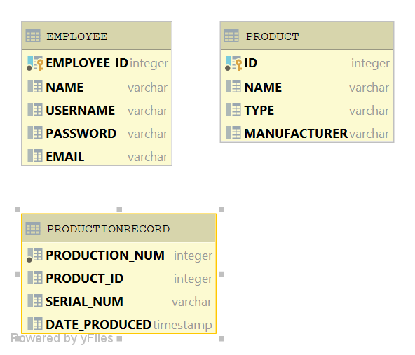

# Project Title
This project is a production line tracker for a metaphorical production company. I made this independently over the course of three months. This project was developed for my object-oriented programming class at Florida Gulf Coast University. This was my first project with a fully integrated UI and database integration. Although this was a class assignment I did enjoy the challenges that came with molding UI and database all into one program. 

## Demonstration

## Documentation

## Diagrams

## Getting Started

## Built With

## Contributing

## Author

## License

## Acknowledgments

## History

## Key Programming Concepts Utilized

